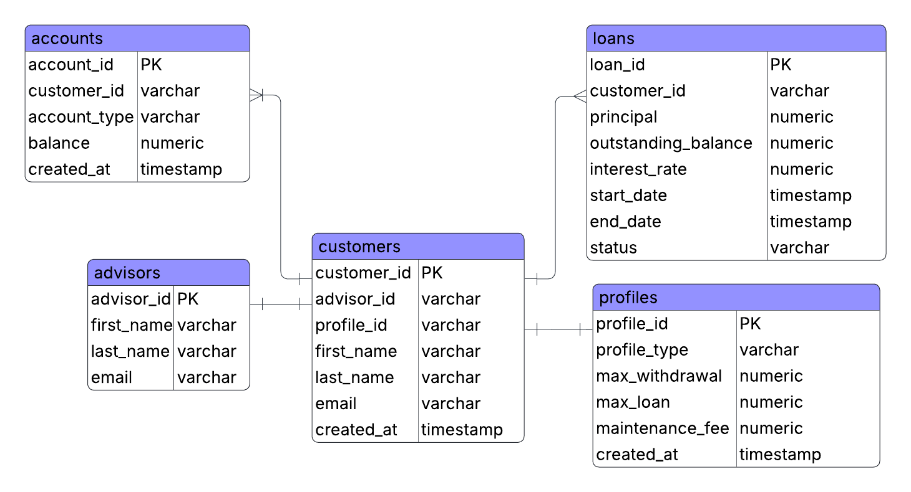
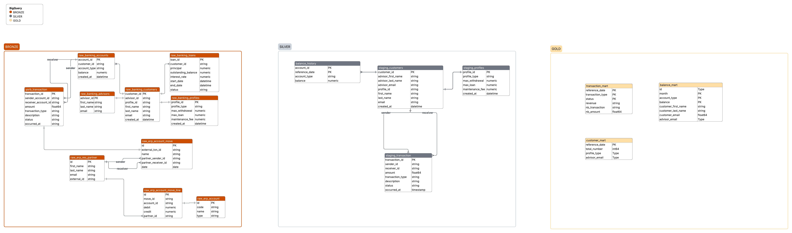

# 🏦 YorBank-Data-Management

This project simulates a **modern data platform** for **Yorbank**, a FinTech company offering online banking services for private individuals.  
Customers can have **normal, savings, and investment accounts**, request **loans**, and are supported by **financial advisors**.  
I integrate both **banking transaction data (via API)** and **ERP accounting data and customers data (via postgreSQL)** into a **BigQuery data warehouse**, and use **dbt** to build **Bronze → Silver → Gold** layers following the **Medallion Architecture**.

---

## 🚀 Project Objectives

1. **Advisor Use Case**
   - Daily report of customers with:
     - Overdrawn balances for 3 consecutive months  
     - Customers reaching max withdrawal limits over the last 3 months  
   - Advisors only see **their customers’ alerts**.

2. **Business Use Case**
   - Dashboard for revenue:
     - Commission on account maintenance  
     - Profit on loans  
     - number of customer
     - amount of transaction
     - number of transaction

---

## 🏗️ Architecture Overview

COMING SOON

## 📂 Data Sources

- Banking API :Transactions stream (deposit, withdrawal, loan_repayment, etc.)
```
**[
    {
        "transaction_id": "Integer",
        "sender_account_id": "String",
        "receiver_account_id": "String",
        "amount": "Decimal",
        "transaction_type": "String",
        "description" : "String" ,
        "status": "String",
        "occurred_at": "YYYY-MM-DDTHH:MM:SSZ"
    }

]**
```
- Accounts and ERP details




🧱 Medallion Architecture




## ⚙️ Tech Stack
1. Ingestion
   1. Kafka on Confluent Cloud for real-time streaming (transactions API)
   2. Airbyte for batch ingestion
2. Warehouse
   1. Big Query
3. Transformation
   1. dbt
4. Orchestration
   1. Airglow to schedule dbt flow and data export
5. Visualizattion
   1. Power BI dashboards for business team
   2. CSV/Excel exports for advisors


